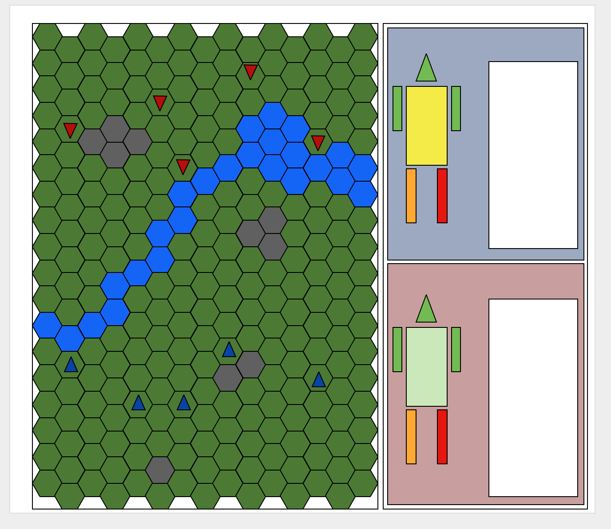

# mech-combat

## Game:
https://jufebrown.github.io/mech-combat/

## Concept:

### Outline:
This is a turn-based strategy game loosely based on the Battletech board game. It is a top down game on a hex grid. The player and the computer take turns moving and attacking.

### Trello:
https://trello.com/b/DlQu8S14/front-end-capstone

### Moqup:

## Resources:

### Technologies Used:
Phaser.js
Firebase

### Tutorial:
http://www.redblobgames.com/grids/hexagons/

### Mech Sprites:
http://opengameart.org/users/skorpio

### Music:
Alert
by Alexandr Zhelanov, https://soundcloud.com/alexandr-zhelanov
